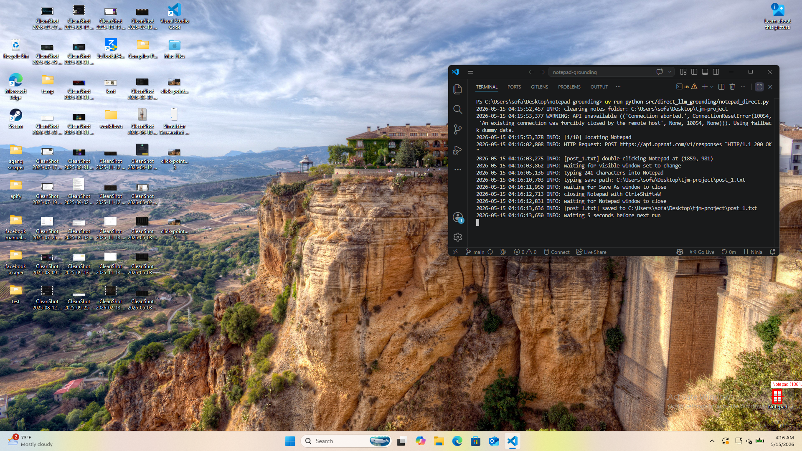
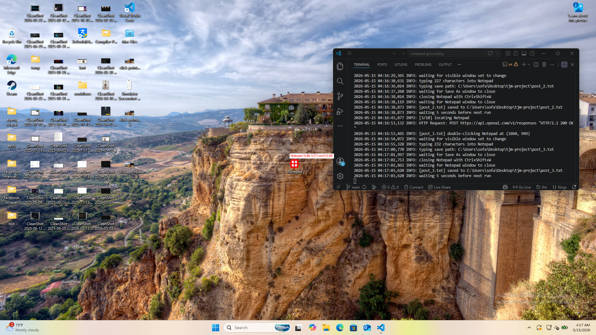
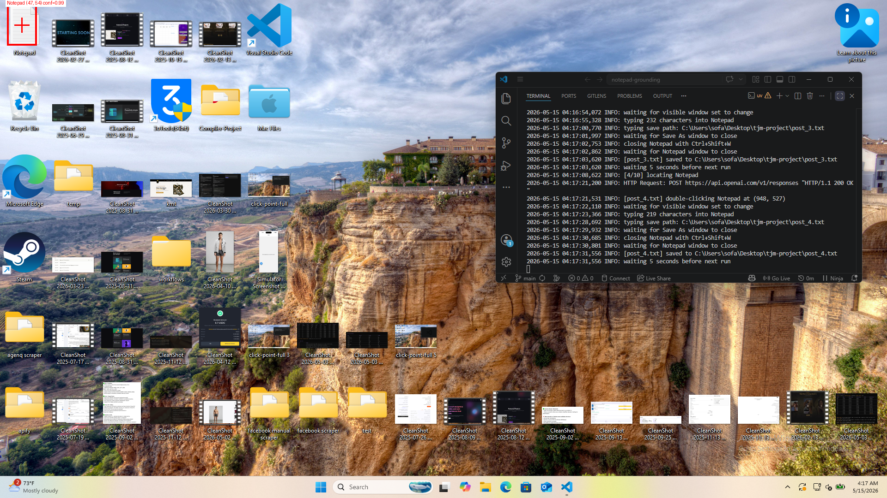
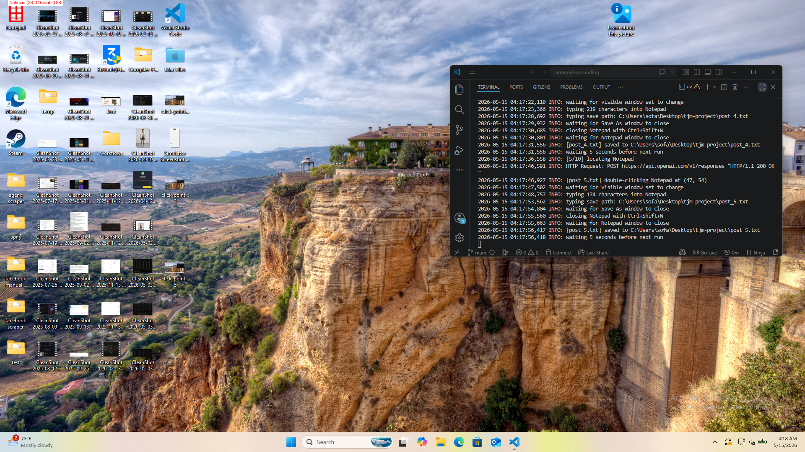

# Vision-Based Desktop Automation — Submission Document

**Project:** Notepad Grounding  
**Command:** `uv run notepad-grounding`  
**Platform:** Windows 11, 1920x1080, 100% scale  
**Repository:** https://github.com/sofa5060/notepad-grounding

---

## How It Works

The system uses LLM vision to locate desktop icons without accessibility APIs, window handles, or pre-recorded coordinates. The LLM returns structured output; code owns all coordinate math.

### Icon Locating (llm.py)

1. Capture a full desktop screenshot (1920x1080)
2. Send it to the LLM with a prompt describing the target icon
3. LLM returns structured JSON via `text_format` with Pydantic schema validation
4. Confidence gating: minimum 0.85 confidence required; up to 3 retries with 1s delays on low confidence or API errors. If all attempts are below threshold, the run is skipped entirely (no click occurs).
5. Result includes center point (x, y) and bounding box, both clamped to screen dimensions
6. Annotated screenshot saved showing bounding box, crosshair, and confidence

### Automation Flow (main.py + automation.py)

1. Take screenshot → locate Notepad icon
2. Double-click the icon center
3. Wait for window launch (visible window set change detection via Win32 API)
4. Type post content (Title + body)
5. Save via Ctrl+Shift+S → type path → Enter
6. Close via Ctrl+Shift+W (Alt+F4 fallback)
7. Repeat for 10 posts

### Error Handling

| Scenario | Handling |
|----------|----------|
| Icon not found / low confidence | Retry up to 3 times, 1s delay; skip run if still below 0.85 |
| API unavailable (fetching posts) | Retry up to 3 times, 5s delay; graceful fallback to dummy data |
| Window fails to open | Timeout after 8 seconds |
| Close fails (Ctrl+Shift+W) | Alt+F4 fallback |
| Existing files in target directory | Directory cleaned before each run |

---

## Test Evidence

### Case 1: Bottom-Right — Small Icons, Busy Background

### Case 2: Center — Small Icons, Busy Background

### Case 3: Top-Left — Large Icons, Busy Background

### Case 4 (Bonus): Top-Left — Medium Icons, Busy Background

---

## Summary

Successfully tested across:
- **3 screen positions**: top-left, center, bottom-right
- **3 icon sizes**: small, medium, large
- **Busy/cluttered backgrounds**
- **Structured output** with confidence gating and retry logic
