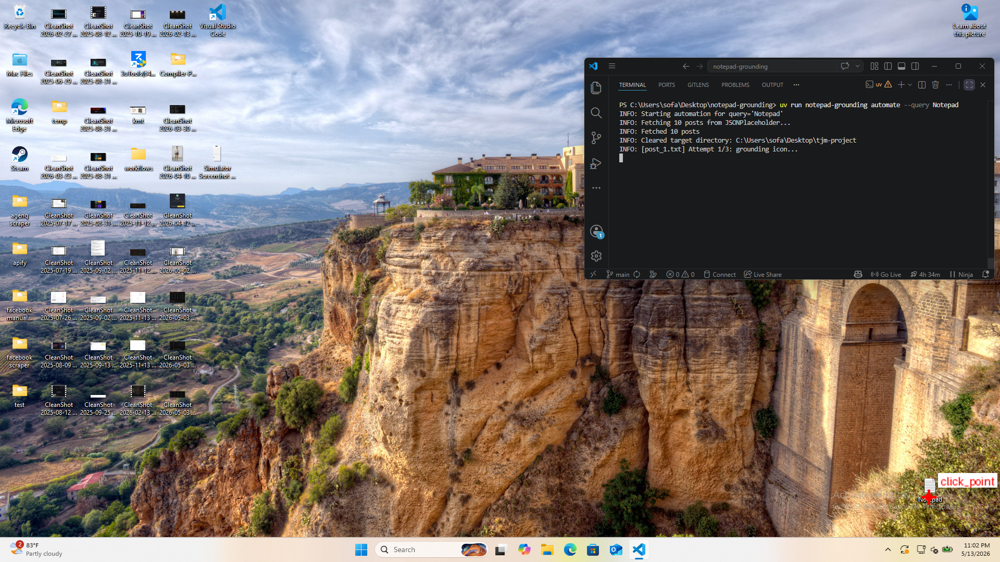
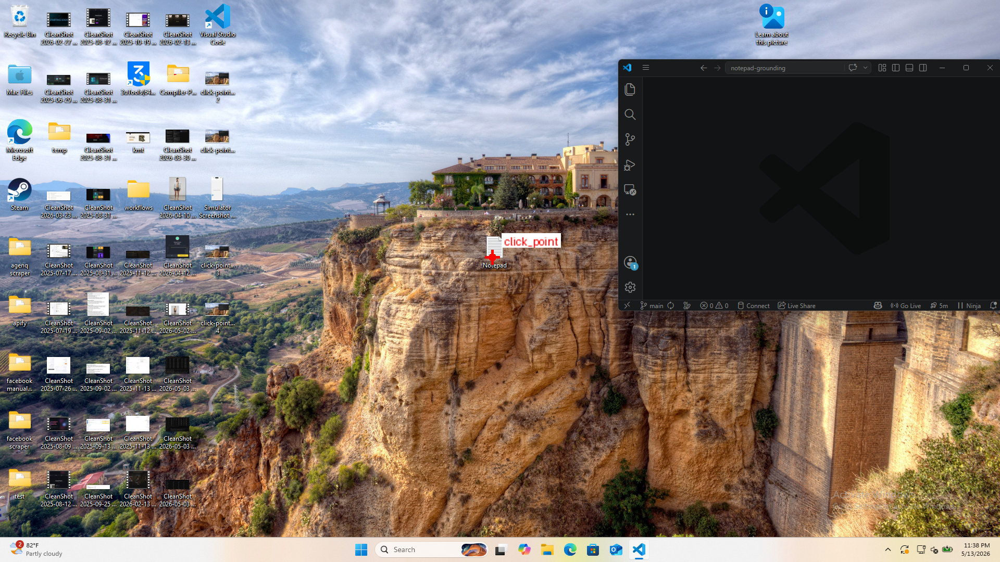
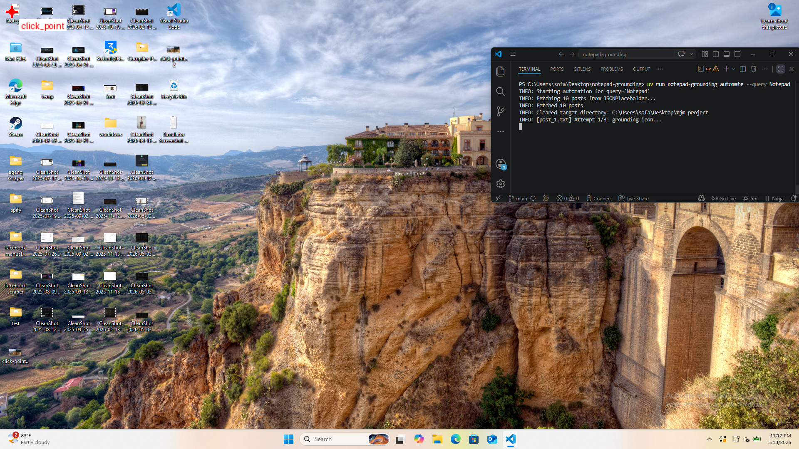

# Vision-Based Desktop Automation — Submission Document

**Project:** Notepad Grounding  
**Command:** `uv run notepad-grounding`  
**Platform:** Windows 11, 1920×1080, 100% scale  
**Repository:** https://github.com/sofa5060/notepad-grounding

---

## How It Works

The system locates desktop icons using **LLM vision** without relying on accessibility APIs, window handles, or pre-recorded coordinates. The LLM makes visual judgments; code owns all screen-coordinate math.

This design aligns with the ScreenSpot-Pro paper (arXiv:2504.07981): *reducing the search area enhances accuracy*.

### Different Approaches

We explored and rejected several approaches before settling on LLM vision:

- **Template matching** — fails across wallpapers, themes, and icon sizes  
- **OCR only** — breaks when labels are renamed, missing, or hard to read on busy backgrounds  

LLM vision was chosen because it generalizes to arbitrary icons, positions, and backgrounds without retraining.

---

## Stage 1: Coarse-to-Fine Grid Search (Grid Search + Reviewer)

The system divides the screen into a labeled grid and asks the LLM which cell contains the target.

**Round 1:** Draw a 3×4 grid over the full screenshot. The LLM picks one cell from 12 options.  
**Round 2:** Crop around the selected cell, draw a 3×3 grid. The LLM picks again from 9 options.  
**Round 3:** Crop further, draw a 5×5 grid. The LLM picks from 25 options.

After each selection, a **target crop reviewer** crops the selected cell with padding and asks a second vision call: *"Does this crop actually contain the target icon or label?"*

- If the reviewer says **yes** → continue to next round
- If the reviewer says **no** → the chooser is corrected in the same conversation (using `previous_response_id`) and must pick a different cell

This prevents the cascading failure where one wrong cell selection ruins all subsequent crops.

---

## Stage 2: Marked Click-Grid Precision

Once the crop is small enough (~450×350 px), the system switches to a **labeled row/column grid** for final precision.

**Step 1 — Coarse grid:**
- Draw a 7×7 yellow grid over the final crop
- Row numbers are drawn on the left, column numbers above the image — both outside the screenshot content
- The LLM picks a cell using row/column format like `R3C4`
- A reviewer validates the selected cell crop before accepting it

**Step 2 — Fine grid:**
- Crop a small region around the accepted coarse cell
- Draw a finer 5×5 row/column grid on this smaller crop
- The LLM picks the final cell (e.g., `R2C3`)
- The reviewer validates again

**Step 3 — Center calculation:**
- Code maps the final cell's center back to screen coordinates deterministically
- Draws a red crosshair marker (`click_point`) on the full screenshot
- No pixel coordinates come from the LLM — only labeled cell IDs

---

## Stage 2 Fallback: Bbox Precision

If the click-grid method fails (e.g., reviewer rejects all attempts), the system falls back to **bbox refinement**:

1. The LLM draws a tight bounding box around the icon graphic (not the text label)
2. The system draws the red box on the crop and sends it back to the LLM
3. The LLM reviews: *"Is this box tight, centered, and not overlapping other icons?"*
4. If corrected → iterate (up to 3 refinements)
5. Code computes the bbox center and maps it to screen coordinates

This fallback ensures reliability even when the grid method encounters ambiguous crops.

---

## Stage 3: Click and Recovery

**Normal flow:** Compute center from the selected cell → double-click.

**Recovery mechanisms:**

| Scenario | Detection | Action |
|----------|-----------|--------|
| Wrong app opened | Reviewer checks window title | Alt+F4 then Escape (dismisses shutdown dialog if desktop was focused) |
| Pop-up or dialog appears | Reviewer sees unexpected window | Press Enter |
| Icon not found | LLM returns `target_visible: false` | Retry up to 3 attempts with 1s delay |
| API unavailable | Network error fetching posts | Use built-in dummy data (10 synthetic posts) |

---

## Test Evidence

All scenarios were tested on a **busy/cluttered background**, which is significantly harder than a solid-color background.

### Case 1: Bottom-Right with Small Icons

- **Position:** Bottom-right corner of screen
- **Icon size:** Small (96px)
- **Result:** Success — red `click_point` marker on Notepad icon
- **Screenshot:**

*Figure 1: Notepad icon detected at bottom-right with small icons on busy background*

---

### Case 2: Top-Left with Small Icons

- **Position:** Top-left corner of screen
- **Icon size:** Small (96px)
- **Result:** Success — red `click_point` marker on Notepad icon
- **Screenshot:**

*Figure 2: Notepad icon detected at top-left with small icons on busy background*

---

### Case 3: Center with Medium Icons

- **Position:** Center of screen
- **Icon size:** Medium (standard Windows size)
- **Result:** Success — red `click_point` marker on Notepad icon
- **Screenshot:**

*Figure 3: Notepad icon detected at center with medium icons on busy background*

---

## Summary

The system successfully locates desktop icons across:
- **Three different screen positions** (top-left, center, bottom-right)
- **Three icon sizes** (small, medium, and large)
- **Busy/cluttered backgrounds** (much harder than solid colors)
- **With recovery mechanisms** for wrong clicks, pop-ups, and API failures

All coordinate math is deterministic. The LLM only makes visual choices (labeled grid cells and row/column cell IDs). Code handles all screen-to-click transformations. The marked click-grid approach with reviewer validation provides precise, explainable localization without requiring raw pixel coordinates from the LLM.
